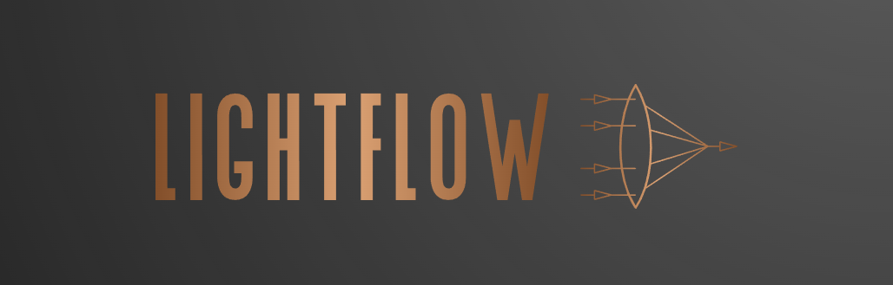

  

LightFlow is an open-source framework for optics and photonics simulations, focused on providing a user-friendly and modular platform for both education and research. It aims to simplify the process of implementing and experimenting with computational methods in wave optics, offering a standardized and expandable framework for optical components and systems.

## Features

- Modular and easy-to-understand framework for optical components and systems
- GPU acceleration for high-speed simulations
- Python-based, integrating with popular libraries such as TensorFlow and Keras
- Suitable for educational and research purposes in the fields of optics and photonics

## Installation

_Coming soon._

## Getting Started

_Coming soon. Examples and tutorials on how to use LightFlow will be provided._

## Documentation

_Coming soon. Detailed documentation on LightFlow's API and functionalities will be provided._

## Examples

_Coming soon. Example notebooks and projects using LightFlow for various applications will be provided._

## Contributing

We welcome contributions from the community. If you have ideas, bug reports, or improvements, feel free to open an issue or submit a pull request.

## License

LightFlow is released under the [MIT License](LICENSE). See the LICENSE file for more details.
