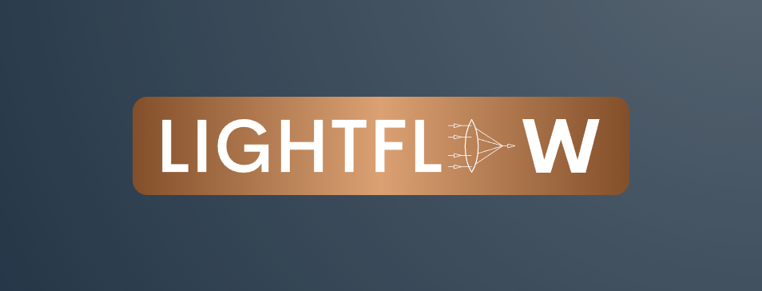

  

LightFlow is an open-source framework for optics and photonics simulations, focused on providing a user-friendly and modular platform for both education and research. It aims to simplify the process of implementing and experimenting with computational methods in wave optics, offering a standardized and expandable framework for optical components and systems.

## Features

- Modular and easy-to-understand framework for optical components and systems
- GPU acceleration for high-speed simulations
- Python-based, integrating with popular libraries such as TensorFlow and Keras
- Suitable for educational and research purposes in the fields of optics and photonics

## Installation

This package is mainly intented for use on google colab, therefore the requirements and dependencies of the package are limited to the packages that are not available in google colab. However, if you successully install the Tensorflow with GPU support on your local machine this package will work properly.
Full support for local operations will be supported soon. Currently there are issues with the installation of Tensorflow with GPU server therefore we hesitate to officially support local operation.

To install LightFlow on a google colab machine simply run the following command:

!pip install git+https://github.com/UNC-optics/LightFlow.git

## Getting Started

We highly encourage you to get started with the tutorials and the examples provided in the `examples` folder. Currently the examples are focused on fundamentals of optics and CGH applications.

## Documentation

_Coming soon._

## Examples

1. [Yann's double slit experiment](https://colab.research.google.com/drive/1hv2mVQE49qdbyP7WC5IrUHcDBT0nO8HC?usp=sharing)
2. [Introduction to Computer Generated Holography](https://colab.research.google.com/drive/1CNKg6Cg2SEkMq_lDWU556laji31ZL1bL?usp=sharing)
3. [GUI demo](https://colab.research.google.com/drive/1XPWRk-6d6i3kdAfgEWOpkmXxBmQAuwth?usp=sharing)

## Contributing

We welcome contributions from the community. If you have ideas, bug reports, or improvements, feel free to open an issue or submit a pull request.

## License

LightFlow is released under the [MIT License](LICENSE). See the LICENSE file for more details.
